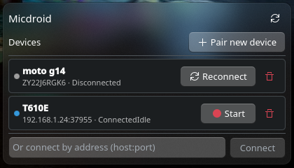
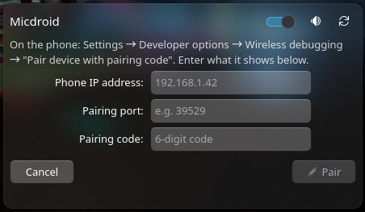

# Micdroid

<p align="center"></p>

<p align="center"><b>Use an Android phone's microphone as a PC microphone over adb/scrcpy, routed into a PipeWire virtual mic.</b><br>
A free, unlimited-time alternative to AudioRelay/WoMic/AndroidMic, controlled from a KDE Plasma 6 widget.</p>

<p align="center">
  
  &nbsp;&nbsp;
  
</p>

## How it works

- [scrcpy](https://github.com/Genymobile/scrcpy) (2.1+) can capture an Android
  device's microphone (`--audio-source=mic`) over USB or wireless adb and play
  it back on the PC.
- A small Python daemon wraps scrcpy + adb: it tracks devices event-driven
  (`adb`'s `host:track-devices` protocol, no polling), spawns scrcpy per
  forwarding session, and moves its audio stream onto a PipeWire virtual mic
  sink/source pair (`pactl move-sink-input` - scrcpy's SDL audio backend
  ignores `PULSE_SINK`/`SDL_AUDIODRIVER`, confirmed by testing, not assumed).
  It exposes all of this over a session D-Bus service (`org.micdroid.Daemon1`).
- The Plasma widget is a thin UI over that D-Bus service - list known
  devices, pair/connect/start/stop forwarding, mute, see live status - with
  no polling on the QML side either (it tails a small runtime event log the
  daemon writes, gap-free even under rapid bursts of state changes).

## Features

- Wireless or USB adb, low-latency mic forwarding via scrcpy
- In-widget pairing (adb pairing code flow) - no terminal required for
  everyday use
- Auto-recovery when a device's wireless debugging port changes (a fresh
  connect attempt failing falls back to mDNS rediscovery automatically)
- Mute toggle for the virtual mic, independent of the forwarding session
- Configurable middle-click quick action on the panel icon (mute /
  disconnect the active device / stop-start the backend), so right-click
  stays the normal panel "Configure/Remove" menu
- Multi-device aware: keeps a roster of every phone you've paired, one
  forwarding session active at a time
- Dependency and backend-service health surfaced directly in the widget,
  with a one-click rescan/restart

## Requirements

Already-installed system tools this project depends on **but does not
install for you**:

- `adb` (Android platform-tools)
- [`scrcpy`](https://github.com/Genymobile/scrcpy) 2.1 or newer (mic
  forwarding needs `--audio-source`, added in 2.1)
- PipeWire's `pactl` and `pw-loopback` (virtual mic + mute)
- `notify-send` (desktop notifications) - present by default on Plasma
- `avahi-browse` (optional) - only used as a fallback to rediscover a
  device's address when its wireless debugging port changes

The widget checks for all of these on startup and tells you exactly which
one is missing if any aren't found, with a one-click rescan once you've
installed it.

- KDE Plasma 6
- Python 3.11+ (for the daemon's own private virtualenv, set up
  automatically - see below)

## What this installs and runs on your system

Nothing here happens silently - this section is the complete list.

**On first run** (automatically, whether you install via `install.sh` or add
the widget from the KDE Store - see [Install](#install)):

- `~/.local/share/micdroid/venv/` - a private Python virtualenv holding the
  daemon and its two small dependencies, [`dbus-next`](https://pypi.org/project/dbus-next/)
  and [`zeroconf`](https://pypi.org/project/zeroconf/), fetched from PyPI
  (needs network access once).
- `~/.config/systemd/user/micdroid.service` - a `systemd --user` unit for the
  daemon. **Not enabled at login** - the widget starts/stops it on demand, so
  it uses zero resources when the widget isn't in use.
- The plasmoid package itself, wherever your install method puts widgets
  (typically `~/.local/share/plasma/plasmoids/com.github.GG2R10.micdroid/`).

**Created/used at runtime** (plain application state, not "installed"):

- `~/.config/micdroid/config.json` - your settings (audio source/codec,
  virtual sink/source names, auto-start, reconnect tuning, quick-action
  choice).
- `~/.config/micdroid/devices.json` - your paired-device roster (name,
  serial, last known address).
- `$XDG_RUNTIME_DIR/micdroid/events.log` - a small log the daemon appends to
  and the widget tails to stay in sync live; truncated on every daemon start,
  not meant to be read directly.

**External processes the daemon spawns while it's forwarding or acting on a
command**: `adb` (pair/connect/shell), `scrcpy` (one instance per active
forwarding session), `pw-loopback` (only if a sink with your configured name
doesn't already exist), `pactl` (routing and mute), `notify-send`
(notifications), `avahi-browse` (mDNS reconnect fallback, optional).

Uninstalling (`./uninstall.sh`) removes the venv, the systemd unit, and the
widget, but leaves `~/.config/micdroid/` (your roster and settings) alone.

## Install

### From a git checkout

```bash
git clone https://github.com/GG2R10/micdroid-scrcpy.git
cd micdroid-scrcpy
./install.sh
```

This sets up the backend (venv + systemd unit, same first-run bootstrap the
widget itself runs - see above) and installs the Plasma widget. Then add
"Micdroid" to a panel or the desktop.

### From the KDE Store

Search for "Micdroid" in Plasma's "Get New Widgets" dialog, install it, and
add it to a panel. The widget bootstraps its own backend (venv + systemd
unit) the first time it loads - no separate script to run. The very first
load takes a few extra seconds while that happens (needs network access
once, to fetch the two small Python packages above).

Uninstall with `./uninstall.sh` from a git checkout (leaves
`~/.config/micdroid/` - your paired device roster and settings - untouched),
or remove the widget from Plasma's widget list, then manually remove
`~/.local/share/micdroid/` and `~/.config/systemd/user/micdroid.service` if
you installed purely via the Store.

## First-time device setup

On your phone: Settings > Developer options > Wireless debugging > "Pair
device with pairing code". In the widget, click **Pair new device** and
enter the IP, pairing port, and 6-digit code it shows. The daemon runs
`adb pair`, then tries to auto-discover the (separate) *connect* port via
mDNS and finish connecting in one step.

If that auto-discovery doesn't find it (e.g. Avahi isn't installed, or the
phone stopped advertising it), pairing itself still succeeded - use the
"Or connect by address" field at the bottom of the device list with the
IP:port shown on the phone's main Wireless debugging screen (not the pairing
dialog's port). Either way, the device then appears in your list
permanently, and pairing itself never needs to be repeated - not even if the
phone's IP or wireless debugging port later changes (see below) - unless the
device is unpaired on the phone (e.g. after a factory reset).

**If reconnecting ever fails** ("Connection refused" and similar): wireless
debugging's *connect port* is ephemeral and commonly changes when you toggle
it off/on, so the widget automatically falls back to mDNS rediscovery on
your same phone's IP before giving up - you'll get a desktop notification
and an inline message either way, so a failure is never silent. If your
phone's *IP itself* changes (e.g. after a router reboot), that fallback
won't find it - reconnect once via "Connect by address" with the new IP:port
and no pairing is needed for that either.

## Usage

- **Left-click** the panel icon to open the popup.
- **Middle-click** runs your configured quick action (Settings > Advanced) -
  mute is the default; disconnecting the active wireless device and
  stopping/starting the backend are the alternatives. Right-click keeps the
  normal Plasma panel context menu.
- The switch in the popup header turns the backend service on/off; the
  speaker icon next to it mutes/unmutes the virtual mic independently of
  whether anything is actively forwarding.

## Development

```bash
cd package/contents/daemon
python3 -m venv .venv && .venv/bin/pip install -e .
.venv/bin/python -m micdroid_daemon        # run the daemon directly, Ctrl-C to stop
journalctl --user -u micdroid.service -f   # daemon logs, once installed as a service
```

For the widget: `kpackagetool6 -t Plasma/Applet -i package/` (or `-u` to
upgrade an existing install), then `plasmawindowed com.github.GG2R10.micdroid`
to open it standalone (`plasmoidviewer` from `plasma-sdk` also works, and
reloads faster, if you install that package).

## License

GPL-3.0-or-later for this project's own code.

This project doesn't bundle or redistribute any of the following - it just
invokes them as external tools already installed on your system, same as
any program that shells out to `ffmpeg` or `curl` - but credit where it's
due:

- [scrcpy](https://github.com/Genymobile/scrcpy) (Apache-2.0) does the
  actual screen/audio mirroring work this project builds on.
- `adb` is part of the Android Open Source Project (Apache-2.0).
- [PipeWire](https://pipewire.org/) (MIT) provides the virtual microphone
  and audio routing.
